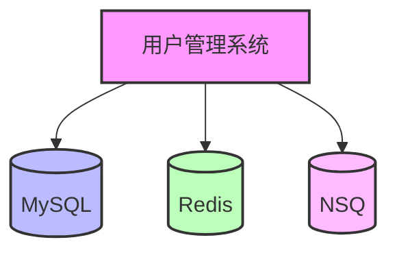

# Agent Skills

本目录包含六个 AI Agent Skills，用于辅助代码开发、审查、测试、文档和架构工作。

## Skills 概览

### 1. mr-check
**作用**：MR/PR 代码审查

当用户需要审查 GitLab 或 GitHub Merge Request (MR) / Pull Request (PR) 中的代码变更时激活此技能。扮演严谨、客观的资深技术负责人，深度分析代码变更并提供专业审查意见。

**主要功能**：
- 从 GitLab/GitHub 获取 MR/PR 代码变更
- 深度分析代码变更（逻辑错误、安全风险、性能瓶颈、异常风险、编码规范）
- 生成结构化审查评论
- 将审查评论发布到 MR/PR

**适用场景**：
- 代码审查
- MR/PR 质量检查
- 代码质量评估

**依赖**：
- GitLab MCP 服务（获取 MR 变更、发布评论）
- GitHub MCP 服务（获取 PR 变更、发布评论）
- 代码分析 MCP 服务（可选，用于深度分析）

### 2. code-convention
**作用**：AI Vibe Coding 开发规范

当用户需要编写代码、进行代码检查或编写代码测试时激活此技能。提供全面的开发规范指导，确保代码质量、安全性和可维护性。

**主要功能**：
- 提供编程语言规范（Go、JavaScript）
- 提供数据库规范（MySQL、MongoDB）
- 提供 Web API 开发规范
- 提供高并发处理规范
- 提供数据库请求规范
- 提供缓存一致性规范
- 提供注释规范：每个函数都需要加上中文注释，注释说明函数作用
- 提供复杂逻辑注释规范：函数中特别复杂的逻辑也需要加上中文注释，说明为什么这么写
- 提供代码复用规范：如果发现相似的代码超过2个，就要封装成函数调用
- 提供函数长度规范：函数的长度不宜过长，不易超过1千行，如果超过一千行，需要封装内部子函数缩短单个函数的长度

**适用场景**：
- 编写新代码
- 进行代码审查和检查
- 编写单元测试
- 重构现有代码
- 优化代码性能
- 设计数据库结构
- 开发 Web API 接口

**规范参考**：
- Go 官方标准、字节跳动和阿里云的 Go 代码开发规范
- JS 官方标准、字节跳动和阿里云的 JS 代码开发规范
- MySQL 官方标准、字节跳动和阿里云的 MySQL SQL 规范
- MongoDB 官方标准、字节跳动和阿里云的 MongoDB NoSQL 规范
- API 官方标准、字节跳动和阿里云的 API 开发规范
  - API 变量驼峰命名，首字母小写
  - 读请求用 Get，写请求用 Post
  - 参数复杂的读请求可以用 Post
- 字节跳动和阿里云的高并发、数据库请求、缓存一致性规范

### 3. qa-case
**作用**：测试用例生成

当用户需要根据 GitLab 代码变更生成测试用例时激活此技能。分析代码变更，识别影响的接口、页面、功能和流程，生成各端的功能测试用例、压测用例以及整体系统测试用例。

**主要功能**：
- 从 GitLab 获取 MR 代码变更
- 分析项目信息
- 分析代码变更影响（接口、页面、功能、流程、端）
- 生成各端测试用例（前端、服务端、PC 端、安卓端、iOS 端）
- 生成整体系统测试用例（跨端功能、端到端流程、整体性能、整体压测）
- 将测试用例发布到 MR

**适用场景**：
- 代码变更后的测试用例生成
- MR/PR 的测试用例生成
- 功能测试用例生成
- 性能测试用例生成
- 压测测试用例生成

**依赖**：
- GitLab MCP 服务（获取 MR 变更、发布评论）
- 分析 GitLab 仓库代码的 MCP 服务（可选，用于分析项目信息）

### 4. code-test
**作用**：代码测试生成

当用户需要为生成的代码或改动代码时激活此技能。根据代码语言和项目上下文，生成单元测试、系统功能测试、系统压力测试和系统破坏性测试。

**主要功能**：
- 生成单元测试（Go、Shell、JavaScript）
- 生成系统功能测试（覆盖所有单元测试）
- 生成系统压力测试（针对 HTTP、gRPC、NSQ 等外部接口，支持多梯度）
- 生成系统破坏性测试（针对 HTTP、gRPC、NSQ 等外部接口，测试异常输入）
- 提供测试可视化界面
- 生成测试执行脚本和测试使用说明

**单元测试要求**：
- 对于每次代码生成和代码改动，都需要按语言规范生成相关的单元测试用例
- Go 语言生成 `_test.go` 文件
- 测试用例除了基本的功能测试参数，还要包括破坏性参数的传入传出
- 需要结合项目函数上下文，如果函数的传入参数在项目中不可能出现空值，测试用例就没必要带空值

**系统功能测试要求**：
- 对于每次代码生成和代码改动，都需要按语言规范生成相关的系统自动化测试用例
- 尝试获取项目的文档和代码信息来了解项目
- 系统测试要覆盖所有单元测试
- 对于网络 API、消息队列等网络中间件，要实现接口的功能测试

**系统压力测试要求**：
- 压力测试只针对外部网络 API 生成，如 HTTP、gRPC、NSQ 等外部接口
- 压力测试要支持多梯度，从而最大程度了解接口的性能
- 测试不同并发级别下的性能表现
- 测试不同数据量下的性能表现

**系统破坏性测试要求**：
- 破坏性测试只针对外部网络 API 生成，如 HTTP、gRPC、NSQ 等外部接口
- 传入空异常值和 SQL 注入等异常值
- 对异常情况，如果没有出现错误则认为测试失败
- 对于错误，不是用简单的协议状态码，而是根据项目功能场景判断
- 比如：返回 HTTP 错误码是 200，但是返回的 JSON 里面 code 不为 0，也认为是返回了错误

**适用场景**：
- 为新生成的代码生成测试用例
- 为代码改动生成测试用例
- 补充现有代码的测试用例
- 生成系统自动化测试框架

**测试类型**：
- 单元测试：测试单个函数或方法的功能
- 系统功能测试：测试系统的功能是否符合预期
- 系统压力测试：测试系统在高并发下的性能表现
- 系统破坏性测试：测试系统对异常输入的处理能力

**测试框架**：
- Go：GoConvey（提供 Web 可视化界面）
- Shell：Bats（Bash Automated Testing System）
- JavaScript：Jest（提供 HTML 测试报告）

**测试目录结构**：
```
./test/
├── README.md              # 测试使用说明
├── run.sh                 # 测试执行脚本
├── unit/                  # 单元测试
├── system/                # 系统测试
│   ├── functional/        # 功能测试
│   ├── stress/            # 压力测试
│   └── destructive/       # 破坏性测试
└── report/                # 测试报告
```

**测试命令**：
- 运行所有测试：`./test/run.sh all`
- 运行单元测试：`./test/run.sh unit`
- 运行系统功能测试：`./test/run.sh functional`
- 运行系统压力测试：`./test/run.sh stress`
- 运行系统破坏性测试：`./test/run.sh destructive`
- 启动测试可视化界面：`./test/run.sh web`

### 5. code-docs
**作用**：代码文档生成

当用户需要为生成的代码或代码改动生成相关文档时激活此技能。根据代码语言和项目上下文，生成 README.md、Dependency.mmd、API.md 和 Page.md 等文档。

**主要功能**：
- 生成项目使用文档（README.md）
- 生成项目外部组件依赖图（Dependency.mmd）
- 生成网络接口文档（API.md）
- 生成页面接口文档（Page.md）
- 分析项目代码确认依赖的外部组件
- 参考 Swagger 文档生成 API.md
- 保证文档的时效性

**适用场景**：
- 为新生成的代码生成文档
- 为代码改动更新文档
- 补充现有代码的文档
- 生成项目使用文档
- 生成项目依赖图
- 生成 API 接口文档
- 生成页面接口文档

**文档类型**：
- README.md：项目使用文档，说明项目名称、描述、核心功能、架构、使用方式、依赖、启动、部署、测试
- Dependency.mmd：项目外部组件依赖图，使用 Mermaid graph 语法
- API.md：项目网络接口文档，说明 API 功能、调用方式、请求参数、响应参数、错误码
- Page.md：项目页面接口文档，说明页面路由、功能、参数信息

**文档放置位置**：
- README.md：`./README.md`
- Dependency.mmd：`./Dependency.mmd`
- API.md：`./API.md`
- Page.md：`./Page.md`

**文档更新时机**：
- 每次代码生成后
- 每次代码修改后
- 项目架构变更后
- 新增或删除功能后
- 新增或删除依赖后

**文档适用范围**：
- README.md：所有项目
- Dependency.mmd：所有项目
- API.md：服务端和相关 SDK
- Page.md：前端和客户端

### 6. code-architecture
**作用**：代码架构规范

当用户需要生成代码或修改代码时，此技能用于指导代码的文件结构组织。根据代码语言和项目类型，按照各语言的官方规范和最佳实践来组织代码文件结构，确保代码结构清晰、易于维护和扩展。

**主要功能**：
- 提供代码架构指导原则
- 提供各语言的代码结构规范
- 提供目录和文件命名规范
- 提供最佳实践和注意事项

**适用场景**：
- 生成新代码时的文件结构组织
- 修改现有代码时的结构调整
- 重构项目时的架构优化
- 代码审查时的结构检查

**架构原则**：
- 代码结构清晰：文件和目录的命名和组织应该清晰明了，易于理解
- 按各自语言的组织规范划分目录和文件名：遵循各编程语言的官方规范和最佳实践

**支持的语言和框架**：
- Go：遵循 Go 官方标准和社区约定
- JavaScript：适用于纯 JavaScript 项目、前端项目和通用 JavaScript 库
- Vue：遵循 Vue.js 官方的最佳实践和社区约定
- React：遵循 React 官方的最佳实践和社区约定
- Angular：遵循 Angular 官方的最佳实践和风格指南
- Electron：遵循 Electron 官方的最佳实践和安全指南
- Node.js：遵循 Node.js 官方的最佳实践和社区约定

**代码架构规范参考**：
- [Go 语言架构规范](code-architecture/references/go.md)
- [JavaScript 架构规范](code-architecture/references/js.md)
- [Vue 架构规范](code-architecture/references/vue.md)
- [React 架构规范](code-architecture/references/react.md)
- [Angular 架构规范](code-architecture/references/angular.md)
- [Electron 架构规范](code-architecture/references/electron.md)
- [Node.js 架构规范](code-architecture/references/nodejs.md)

**Go 语言基础规则**：
- 项目代码的执行入口放到 cmd 目录下
- 项目代码的编译产物放到 bin 目录下
- 项目代码的辅助脚本放到 scripts 目录下
- 项目代码的测试 Demo 放到 example 目录下
- 项目代码的系统测试入口放到 test 目录下
- 项目代码需要对外保留的接口放到 api 目录下
- 项目代码和相关配置放到 config 目录下
- 项目代码的核心逻辑放到 internal 目录下
- 项目代码对第三方的库的相关引用放到 internal/pkg 目录下

**注意事项**：
- 所有的代码生成和代码变更操作都需要遵循这个原则
- 遵循语言规范：严格按照各编程语言的官方规范和最佳实践
- 保持一致性：整个项目的代码结构应保持一致
- 易于扩展：代码结构应支持未来的扩展和修改
- 模块化设计：合理划分模块，避免耦合度过高
- 文档同步：代码结构变更时，同步更新相关文档
- 测试分离：测试代码应与业务代码分离
- 配置管理：配置文件应统一管理
- 依赖管理：第三方依赖应统一管理

## 如何调整 Skill 内容以适应自定义要求

### 1. 修改 SKILL.md 文件
每个 skill 的主文件是 `SKILL.md`，包含以下部分：

#### YAML 前置元数据
```yaml
---
name: skill-name
description: 技能描述
references:
  - reference1.md
  - reference2.md
---
```

**自定义方式**：
- 修改 `name`：更改技能名称
- 修改 `description`：更新技能描述，使其更符合你的使用场景
- 修改 `references`：添加或删除引用的规范文件

#### 激活条件
在 `## 激活条件` 部分定义何时激活此技能。

**自定义方式**：
- 添加新的激活条件
- 修改现有激活条件
- 使激活条件更具体或更宽泛

#### 角色定位
在 `## 角色定位` 部分定义 AI 的角色和行为。

**自定义方式**：
- 修改角色描述
- 添加新的角色要求
- 调整角色的行为方式

#### 工作流程
在 `## 工作流程` 部分定义技能的执行步骤。

**自定义方式**：
- 添加新的工作步骤
- 修改现有工作步骤
- 调整工作流程的顺序

### 2. 修改 references 目录下的规范文件
每个 skill 的 `references` 目录包含具体的规范文件。

**自定义方式**：
- 修改现有规范内容
- 添加新的规范要求
- 删除不需要的规范要求
- 调整规范的优先级

**示例**：
- 修改 `go.md`：添加新的 Go 语言规范
- 修改 `web-api.md`：调整 API 命名规范
- 修改 `frontend.md`：添加新的前端测试要求

### 3. 修改 assets 和 scripts 目录
- `assets` 目录：存放静态资源文件（如图片、配置文件等）
- `scripts` 目录：存放可执行脚本文件

**自定义方式**：
- 添加资源文件到 `assets` 目录
- 添加脚本文件到 `scripts` 目录
- 在 `SKILL.md` 中引用这些资源

### 4. 重新打包 Skill
修改完成后，需要重新打包 skill：

```bash
# 删除旧的压缩包
rm -f skill-name.tar.gz

# 创建新的压缩包
tar -czf skill-name.tar.gz skill-name/
```

## Skill 使用方式

### Filesystem-based Agent
对于基于文件系统的 Agent（如 Trae IDE），Skills 通过文件系统进行集成。

#### Skill 发现
Agent 在启动时会扫描配置的目录，查找包含 `SKILL.md` 文件的文件夹。

#### Skill 加载
Agent 只解析 `SKILL.md` 文件的 YAML 前置元数据，保持初始上下文使用较低。

#### Skill 激活
当用户任务与 Skill 的描述匹配时，Agent 会激活相应的 Skill。

#### 资源访问
Agent 可以通过 shell 命令访问 Skill 捆绑的资源（assets 和 scripts 目录）。

### Tool-based Agent
对于基于工具的 Agent，Skills 通过工具实现进行集成。

#### 工具实现
开发者需要实现特定的工具，允许模型触发 Skill 并访问捆绑的资源。

#### 工具调用
模型通过调用工具来激活 Skill 和访问资源。

### 详细集成指南
详细的集成指南请参考：[https://agentskills.io/integrate-skills](https://agentskills.io/integrate-skills)

该指南包含：
- 集成方法概述
- Skill 发现和加载
- 上下文注入
- 安全考虑
- 参考实现

## 安装和使用

### 1. 安装 Skill
将 skill 目录复制到 Agent 的 skills 配置目录。

### 2. 配置 Agent
根据 Agent 的配置方式，配置 skills 目录路径。

### 3. 重启 Agent
重启 Agent 以加载新的 Skills。

### 4. 使用 Skill
根据 Skill 的激活条件，触发相应的功能。

## 示例

### 示例 1：使用 mr-check 审查代码
```
用户：请帮我审查 https://gitlab.com/example/project 的 MR !123，token 是 abc123

AI：开始执行 MR 代码审查...
正在从 GitLab 获取 MR !123 的代码变更...
成功获取 5 个文件的变更
开始分析代码变更...
分析完成，发现 3 个问题
正在发布评论到 MR...
成功发布评论到 GitLab MR
MR/PR 代码审查完成！
```

### 示例 2：使用 code-convention 编写代码
```
用户：请帮我编写一个 Go 函数，用于从 MySQL 数据库中查询用户信息

AI：根据 [go.md](references/go.md) 和 [database-request.md](references/database-request.md) 规范，以下是一个符合 Go 语言命名规范的函数：

[函数代码]

**符合的规范：**
1. 命名规范
2. 错误处理
3. 数据库请求规范
4. 并发安全
5. 代码格式
```

### 示例 3：使用 qa-case 生成测试用例
```
用户：请为 GitLab MR !456 生成测试用例

AI：正在获取 GitLab MR !456 的代码变更...
成功获取 3 个文件的变更
正在分析项目信息...
分析完成，识别到以下影响：
- 前端：用户列表页面、用户详情页面
- 服务端：用户列表接口、用户详情接口
- 安卓端：用户列表页面、用户详情页面
- iOS 端：用户列表页面、用户详情页面
- 整体系统：用户数据同步流程

正在生成测试用例...
测试用例生成完成
正在发布测试用例到 MR...
成功发布测试用例到 GitLab MR

**发布的评论内容：**
(AI生成) 以下是这次合并的测试用例：
[测试用例列表]

任务完成
```

### 示例 4：使用 code-test 生成测试代码
```
用户：请为以下 Go 函数生成测试用例

func GetUserByID(id int) (*User, error) {
    if id <= 0 {
        return nil, errors.New("invalid user id")
    }
    // 查询数据库
    user, err := db.QueryUser(id)
    if err != nil {
        return nil, err
    }
    return user, nil
}

AI：正在分析代码...
分析完成，识别到以下内容：
- 函数名：GetUserByID
- 参数：id (int)
- 返回值：*User, error
- 逻辑：验证 ID，查询数据库

正在生成测试用例...
测试用例生成完成

**单元测试代码：**
```go
package user

import (
    "testing"
    . "github.com/smartystreets/goconvey/convey"
)

func TestGetUserByID(t *testing.T) {
    Convey("测试根据 ID 获取用户", t, func() {
        Convey("正常用户 ID", func() {
            user, err := GetUserByID(1)
            So(err, ShouldBeNil)
            So(user, ShouldNotBeNil)
            So(user.ID, ShouldEqual, 1)
        })

        Convey("边界值 ID", func() {
            user, err := GetUserByID(0)
            So(err, ShouldNotBeNil)
            So(user, ShouldBeNil)
        })
    })
}
```

**系统功能测试代码：**
```go
package functional

import (
    "net/http"
    "testing"
    . "github.com/smartystreets/goconvey/convey"
)

func TestUserAPI(t *testing.T) {
    Convey("测试用户 API 功能", t, func() {
        baseURL := "http://localhost:8080/api"

        Convey("获取用户列表", func() {
            resp, err := http.Get(baseURL + "/users")
            So(err, ShouldBeNil)
            So(resp.StatusCode, ShouldEqual, 200)
        })
    })
}
```

**系统压力测试代码：**
```go
package stress

import (
    "fmt"
    "net/http"
    "sync"
    "testing"
    "time"
    . "github.com/smartystreets/goconvey/convey"
)

func TestUserAPIStress(t *testing.T) {
    Convey("测试用户 API 压力", t, func() {
        baseURL := "http://localhost:8080/api"

        Convey("低并发测试 (1-10)", func() {
            testAPIStress(baseURL+"/users", 5)
        })

        Convey("中并发测试 (10-100)", func() {
            testAPIStress(baseURL+"/users", 50)
        })
    })
}

func testAPIStress(url string, concurrency int) {
    var wg sync.WaitGroup
    successCount := 0
    failCount := 0
    startTime := time.Now()

    for i := 0; i < concurrency; i++ {
        wg.Add(1)
        go func() {
            defer wg.Done()
            resp, err := http.Get(url)
            if err != nil {
                failCount++
                return
            }
            if resp.StatusCode == 200 {
                successCount++
            } else {
                failCount++
            }
            resp.Body.Close()
        }()
    }

    wg.Wait()
    duration := time.Since(startTime)

    fmt.Printf("并发数: %d, 成功: %d, 失败: %d, 耗时: %v\n",
        concurrency, successCount, failCount, duration)

    So(failCount, ShouldBeLessThan, concurrency/10)
}
```

**系统破坏性测试代码：**
```go
package destructive

import (
    "bytes"
    "encoding/json"
    "net/http"
    "testing"
    . "github.com/smartystreets/goconvey/convey"
)

func TestUserAPIDestructive(t *testing.T) {
    Convey("测试用户 API 破坏性", t, func() {
        baseURL := "http://localhost:8080/api"

        Convey("空值测试", func() {
            resp, err := http.Post(baseURL+"/users", "application/json", bytes.NewReader([]byte("{}")))
            So(err, ShouldBeNil)
            So(resp.StatusCode, ShouldEqual, 200)

            var result struct {
                Code int         `json:"code"`
                Msg  string      `json:"msg"`
                Data interface{} `json:"data"`
            }
            err = json.NewDecoder(resp.Body).Decode(&result)
            So(err, ShouldBeNil)
            So(result.Code, ShouldNotEqual, 0)
        })
    })
}
```

**测试执行脚本：**
```bash
#!/bin/bash

case "$1" in
    all)
        echo "运行所有测试..."
        go test -v ./...
        ;;
    unit)
        echo "运行单元测试..."
        go test -v ./unit/...
        ;;
    functional)
        echo "运行系统功能测试..."
        go test -v ./system/functional/...
        ;;
    stress)
        echo "运行系统压力测试..."
        go test -v ./system/stress/...
        ;;
    destructive)
        echo "运行系统破坏性测试..."
        go test -v ./system/destructive/...
        ;;
    web)
        echo "启动测试可视化界面..."
        goconvey
        ;;
    *)
        echo "使用方法: $0 {all|unit|functional|stress|destructive|web}"
        exit 1
        ;;
esac
```

**测试使用说明：**
```markdown
# 测试使用说明

## 测试环境要求
- Go 1.16 或更高版本
- GoConvey 测试框架
- 项目依赖已安装

## 测试依赖安装
```bash
go get github.com/smartystreets/goconvey
```

## 测试命令说明
```bash
# 运行所有测试
./test/run.sh all

# 运行单元测试
./test/run.sh unit

# 运行系统功能测试
./test/run.sh functional

# 运行系统压力测试
./test/run.sh stress

# 运行系统破坏性测试
./test/run.sh destructive

# 启动测试可视化界面
./test/run.sh web
```

## 测试结果查看
- 命令行查看测试结果
- Web UI 查看测试结果和覆盖率（http://localhost:8080）
```

任务完成
```

### 示例 5：使用 code-docs 生成文档
```
用户：请为以下 Go 项目生成文档

项目结构：
- main.go
- config/config.yaml
- api/user.go
- models/user.go

AI：正在分析项目...
分析完成，识别到以下内容：
- 项目类型：后端服务
- 依赖组件：MySQL、Redis、NSQ
- 暴露的 API：HTTP API

正在生成文档...
文档生成完成

**README.md 文档：**
```markdown
# 用户管理系统

用户管理系统是一个用于管理用户信息的后端服务，提供用户的增删改查、权限管理、数据统计等功能。

## 核心功能

- 用户管理：支持用户的增删改查
- 权限管理：支持角色和权限的管理
- 数据统计：支持用户数据的统计分析

## 项目架构

项目采用单体架构，主要包含以下模块：
- 用户模块：负责用户的基本管理
- 权限模块：负责权限的管理和验证
- 统计模块：负责数据的统计分析

技术栈：
- 后端：Go 1.16+
- 数据库：MySQL 8.0
- 缓存：Redis 6.0
- 消息队列：NSQ

## 使用方式

所有 API 都通过 HTTP 协议调用，基础 URL 为：`http://api.example.com`

详细 API 文档请参考 [API.md](./API.md)

## 中间件依赖

- Redis 6.0+：用于缓存用户信息
- MySQL 8.0+：用于持久化存储用户数据
- NSQ 1.2+：用于异步消息处理

## 本地启动

### 环境要求

- Go 1.16+
- MySQL 8.0+
- Redis 6.0+
- NSQ 1.2+

### 配置说明

复制配置文件模板：

```bash
cp config/config.example.yaml config/config.yaml
```

修改 `config/config.yaml` 中的数据库、Redis 等配置。

### 启动步骤

1. 启动依赖服务

```bash
docker-compose up -d
```

2. 安装依赖

```bash
go mod download
```

3. 运行项目

```bash
go run main.go
```

4. 访问服务

打开浏览器访问：`http://localhost:8080`

## 部署方式

### 环境要求

- Linux 服务器
- Go 1.16+
- MySQL 8.0+
- Redis 6.0+
- NSQ 1.2+

### 部署步骤

1. 编译项目

```bash
go build -o user-service main.go
```

2. 上传到服务器

```bash
scp user-service user@server:/opt/user-service/
```

3. 配置服务

修改服务器上的配置文件 `/opt/user-service/config/config.yaml`

4. 启动服务

```bash
cd /opt/user-service
./user-service
```

## 测试方式

### 单元测试

```bash
go test ./...
```

### 系统测试

```bash
cd test
./run.sh all
```
```

**Dependency.mmd 文档：**


**API.md 文档：**
```markdown
# API 文档

## 通用错误码

| 错误码 | 说明 |
|--------|------|
| 0 | 成功 |
| 1001 | 参数错误 |
| 1002 | 系统错误 |
| 1003 | 未授权 |
| 1004 | 权限不足 |

## 用户 API

### 获取用户列表

**功能**：获取用户列表

**调用方式**：GET /api/users

**请求参数**：

| 参数名 | 类型 | 必填 | 说明 |
|--------|------|------|------|
| page | int | 否 | 页码 |
| size | int | 否 | 每页数量 |

**响应参数**：

| 参数名 | 类型 | 说明 |
|--------|------|------|
| code | int | 状态码 |
| msg | string | 消息 |
| data | object | 数据 |

**响应示例**：

```json
{
  "code": 0,
  "msg": "success",
  "data": {
    "total": 100,
    "list": [
      {
        "id": 1,
        "name": "test"
      }
    ]
  }
}
```

**错误码**：

| 错误码 | 说明 |
|--------|------|
| 0 | 成功 |
| 1001 | 参数错误 |

### 创建用户

**功能**：创建用户

**调用方式**：POST /api/users

**请求参数**：

| 参数名 | 类型 | 必填 | 说明 |
|--------|------|------|------|
| name | string | 是 | 用户名 |
| email | string | 是 | 邮箱 |
| password | string | 是 | 密码 |

**请求示例**：

```json
{
  "name": "test",
  "email": "test@example.com",
  "password": "123456"
}
```

**响应参数**：

| 参数名 | 类型 | 说明 |
|--------|------|------|
| code | int | 状态码 |
| msg | string | 消息 |
| data | object | 数据 |

**响应示例**：

```json
{
  "code": 0,
  "msg": "success",
  "data": {
    "id": 1,
    "name": "test",
    "email": "test@example.com"
  }
}
```

**错误码**：

| 错误码 | 说明 |
|--------|------|
| 0 | 成功 |
| 1001 | 参数错误 |
| 2001 | 用户已存在 |
```

任务完成
```

## 注意事项

### 1. MCP 服务依赖
部分 Skill 依赖 MCP 服务才能正常工作，请确保已配置相应的 MCP 工具。

### 2. Token 安全
使用 Skill 时需要提供访问 token，请妥善保管，不要在公开场合泄露。

### 3. 权限要求
确保 token 有相应的权限（读取代码、发布评论等）。

### 4. 网络连接
确保能够访问相应的 Git 平台和 MCP 服务。

### 5. 自定义建议
在自定义 Skill 时，建议：
- 保持 YAML 前置元数据格式正确
- 保持激活条件清晰明确
- 保持工作流程逻辑清晰
- 保持规范内容具体可操作
- 定期测试 Skill 是否正常工作

## 目录结构

```
agent-skills/
├── README.md                          # 本文件
├── mr-check/                          # MR/PR 代码审查技能
│   ├── SKILL.md
│   └── references/
│       ├── code-analysis-skill.md
│       └── repo-operations-skill.md
├── code-convention/                   # AI Vibe Coding 开发规范技能
│   ├── SKILL.md
│   ├── assets/
│   ├── scripts/
│   └── references/
│       ├── go.md
│       ├── js.md
│       ├── mysql.md
│       ├── mongodb.md
│       ├── web-api.md
│       ├── high-concurrency.md
│       ├── database-request.md
│       └── cache-consistency.md
├── qa-case/                           # 测试用例生成技能
│   ├── SKILL.md
│   ├── assets/
│   ├── scripts/
│   └── references/
│       ├── frontend.md
│       ├── server.md
│       ├── pc.md
│       ├── android.md
│       ├── ios.md
│       └── system.md
├── code-test/                         # 代码测试生成技能
│   ├── SKILL.md
│   └── references/
│       ├── go.md
│       ├── shell.md
│       └── js.md
├── code-docs/                         # 代码文档生成技能
│   ├── SKILL.md
│   └── references/
│       ├── readme.md
│       ├── dependency.mmd.md
│       ├── api.md
│       └── page.md
└── code-architecture/                 # 代码架构规范技能
    ├── SKILL.md
    └── references/
        ├── go.md
        ├── js.md
        ├── vue.md
        ├── react.md
        ├── angular.md
        ├── electron.md
        └── nodejs.md
```

## 许可证

请根据你的项目需求，遵循相应的开源许可证。

## 贡献

欢迎提交 Issue 和 Pull Request 来改进这些 Skills。

## 联系方式

如有问题或建议，请通过以下方式联系：
- 提交 Issue
- 发送邮件
- 参与讨论

## 参考资料

- [Agent Skills 集成指南](https://agentskills.io/integrate-skills)
- [skills-ref 库](https://github.com/agentskills/skills-ref)
