# Dependency.mmd 文档生成规则

## 概述
本文档定义了 Dependency.mmd 的生成规则，Dependency.mmd 是项目的外部组件依赖图，通过分析项目代码来确认依赖的外部组件，生成 Mermaid 的 graph 依赖代码。

## 文档结构

### 1. Mermaid Graph 语法
使用 Mermaid 的 graph 语法来表示项目依赖关系。

#### 基本语法
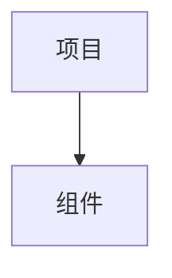

#### 方向说明
- `TD`：从上到下（Top to Down）
- `LR`：从左到右（Left to Right）
- `BT`：从下到上（Bottom to Top）
- `RL`：从右到左（Right to Left）

### 2. 支持的组件类型

#### 数据库组件
- MySQL
- PostgreSQL
- MongoDB
- Redis
- Elasticsearch
- Cassandra
- InfluxDB
- ClickHouse

#### 消息队列组件
- NSQ
- Kafka
- RabbitMQ
- RocketMQ
- ActiveMQ

#### 缓存组件
- Redis
- Memcached

#### 存储组件
- MinIO
- AWS S3
- 阿里云 OSS
- 腾讯云 COS

#### 监控组件
- Prometheus
- Grafana
- ELK Stack
- Jaeger
- Zipkin

#### 配置中心
- Consul
- Etcd
- Nacos
- Apollo

#### 服务发现
- Consul
- Etcd
- Nacos

#### 其他组件
- 其他外部组件

### 3. 依赖关系表示

#### 单向依赖
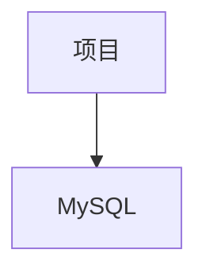

#### 双向依赖
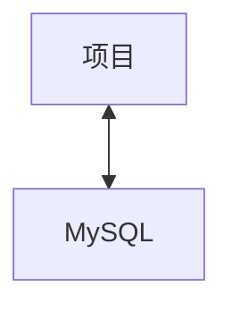

#### 多个依赖
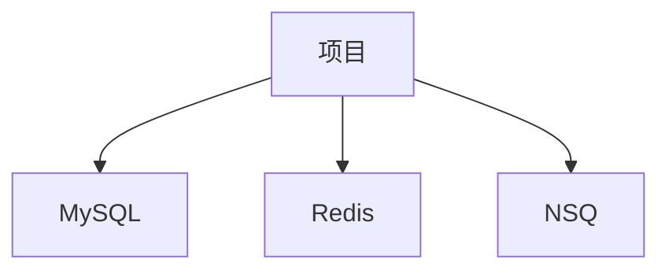

#### 层级依赖
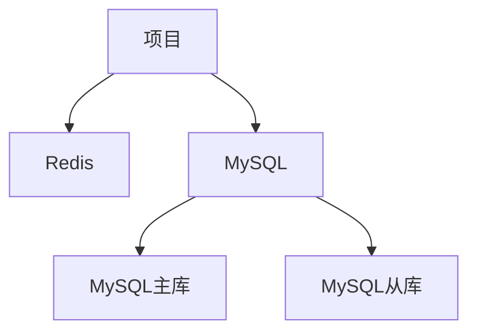

#### 服务间依赖
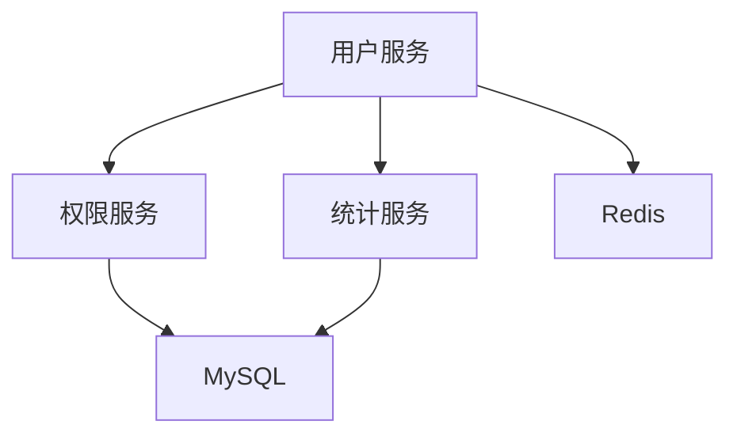

### 4. 组件样式

#### 基本样式
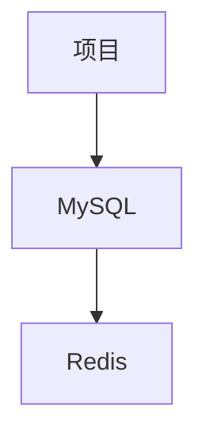

#### 自定义样式
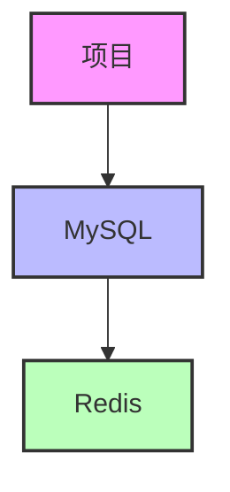

#### 组件图标
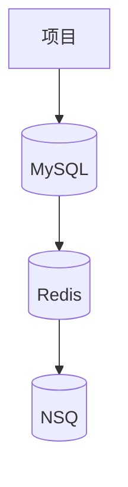

### 5. 分析项目代码确认依赖

#### Go 项目
分析以下内容：
- `import` 语句
- 配置文件（`config.yaml`, `config.json` 等）
- 数据库连接代码
- 缓存连接代码
- 消息队列连接代码

**示例分析**：
```go
import (
    "github.com/go-redis/redis"
    "github.com/go-sql-driver/mysql"
    "github.com/nsqio/go-nsq"
)
```

**生成的依赖图**：
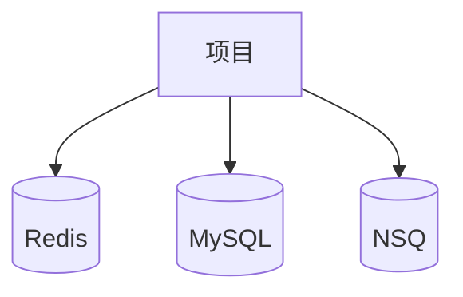

#### JavaScript 项目
分析以下内容：
- `import` 或 `require` 语句
- 配置文件（`config.js`, `config.json` 等）
- 数据库连接代码
- 缓存连接代码
- 消息队列连接代码

**示例分析**：
```javascript
const redis = require('redis');
const mysql = require('mysql');
const nsq = require('nsqjs');
```

**生成的依赖图**：


#### Shell 项目
分析以下内容：
- 配置文件
- 环境变量
- 脚本中的连接命令

**示例分析**：
```bash
mysql -h localhost -u root -p123456
redis-cli -h localhost -p 6379
nsq_to_file --topic=users --output-dir=/tmp
```

**生成的依赖图**：
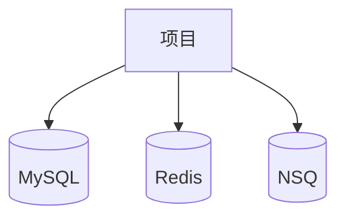

### 6. 常见依赖模式

#### 微服务架构
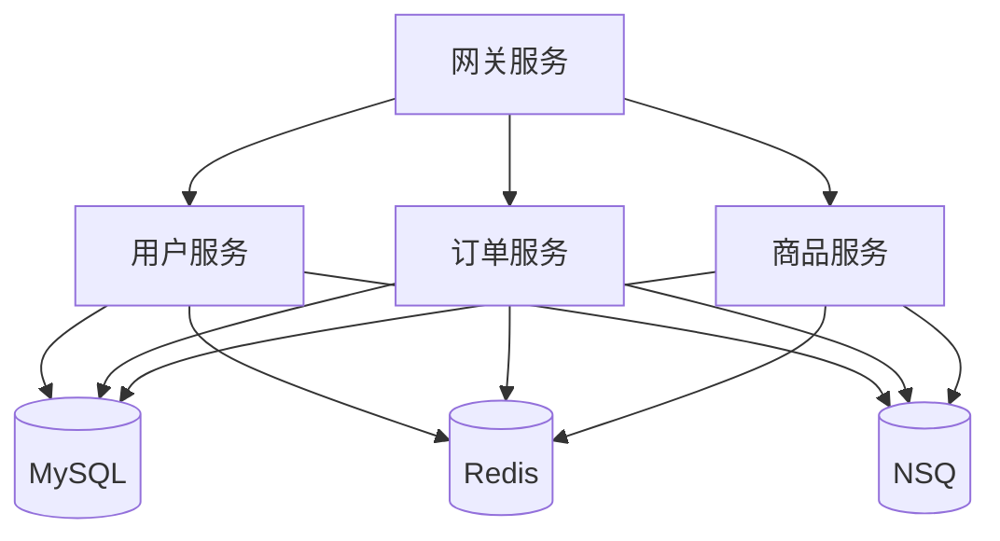

#### 单体架构


#### 前后端分离
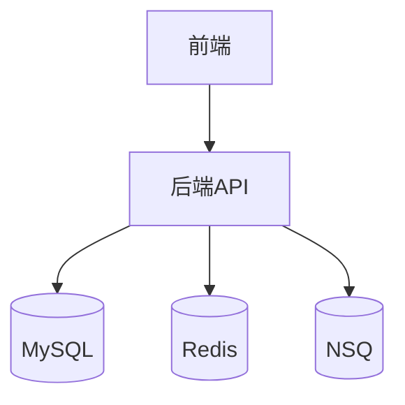

#### 大数据架构
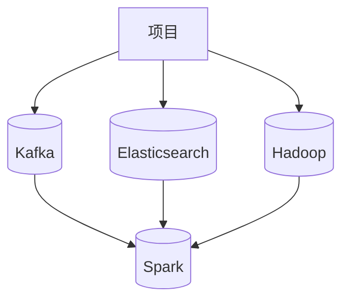

### 7. 依赖图模板

#### 简单模板


#### 复杂模板
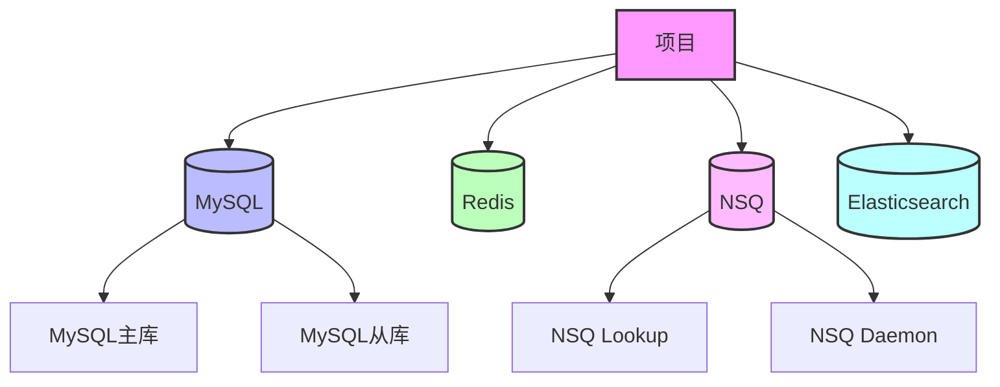

### 8. 组件标签说明

#### 数据库组件标签
- `(MySQL)`：MySQL 数据库
- `(PostgreSQL)`：PostgreSQL 数据库
- `(MongoDB)`：MongoDB 数据库
- `(Redis)`：Redis 缓存
- `(Elasticsearch)`：Elasticsearch 搜索引擎

#### 消息队列组件标签
- `(NSQ)`：NSQ 消息队列
- `(Kafka)`：Kafka 消息队列
- `(RabbitMQ)`：RabbitMQ 消息队列

#### 其他组件标签
- `[组件名]`：其他组件

## 文档放置位置
- 放在项目当前路径下 `./Dependency.mmd`

## 注意事项
- 分析项目代码确认依赖的外部组件
- 使用 Mermaid graph 语法生成依赖图
- 确保依赖关系的准确性
- 使用合适的方向（TD、LR、BT、RL）
- 使用合适的样式和图标
- 保持依赖图的清晰和可读性
- 及时更新依赖图，反映最新的依赖关系
